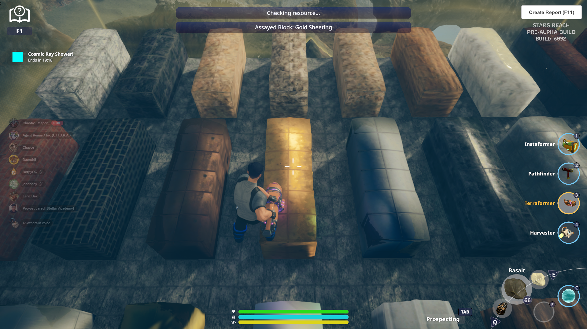
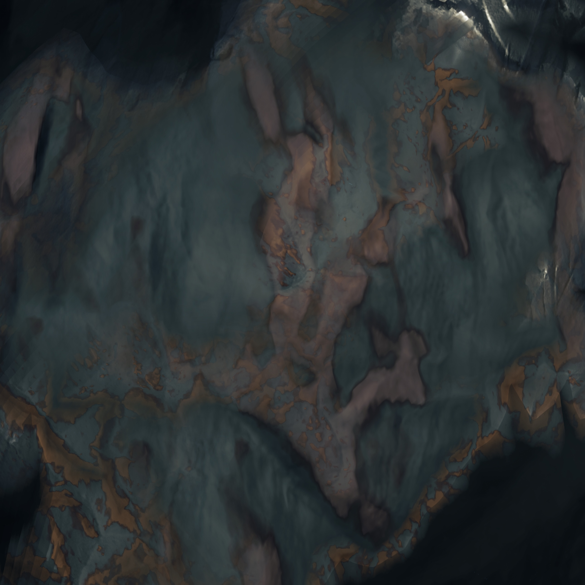
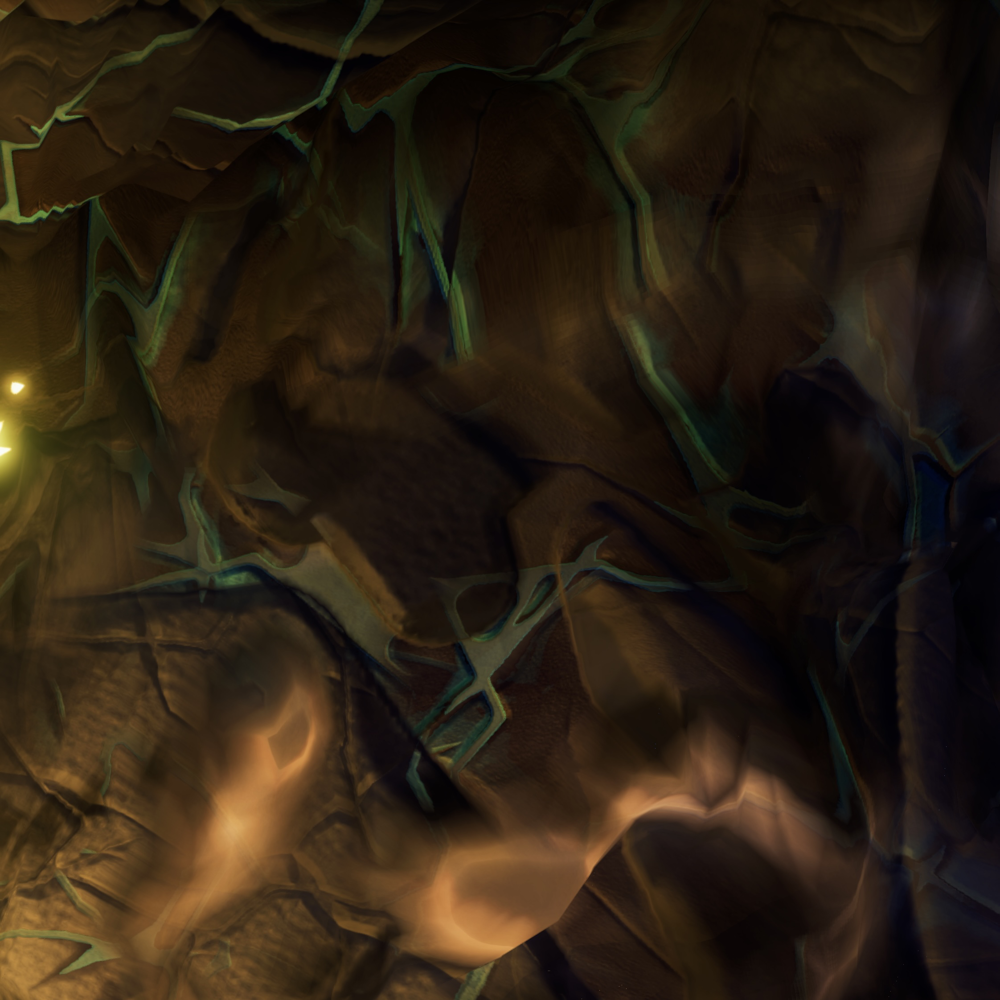
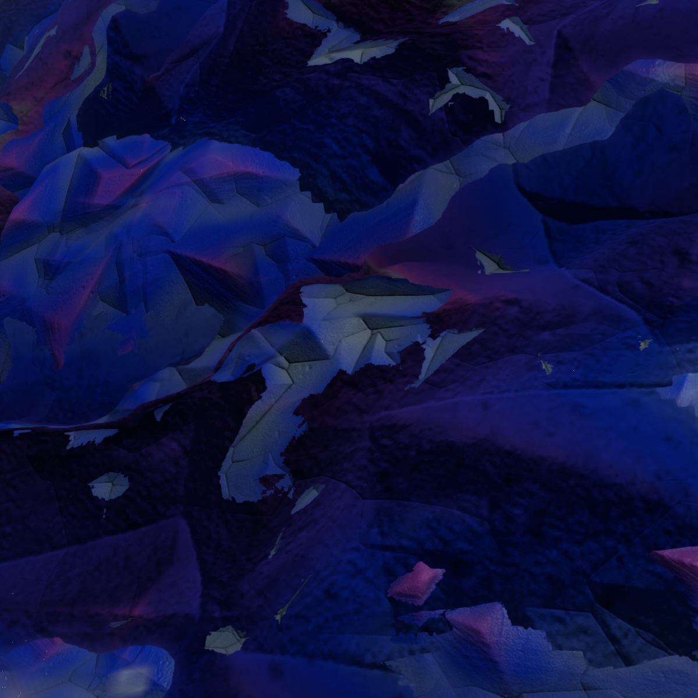
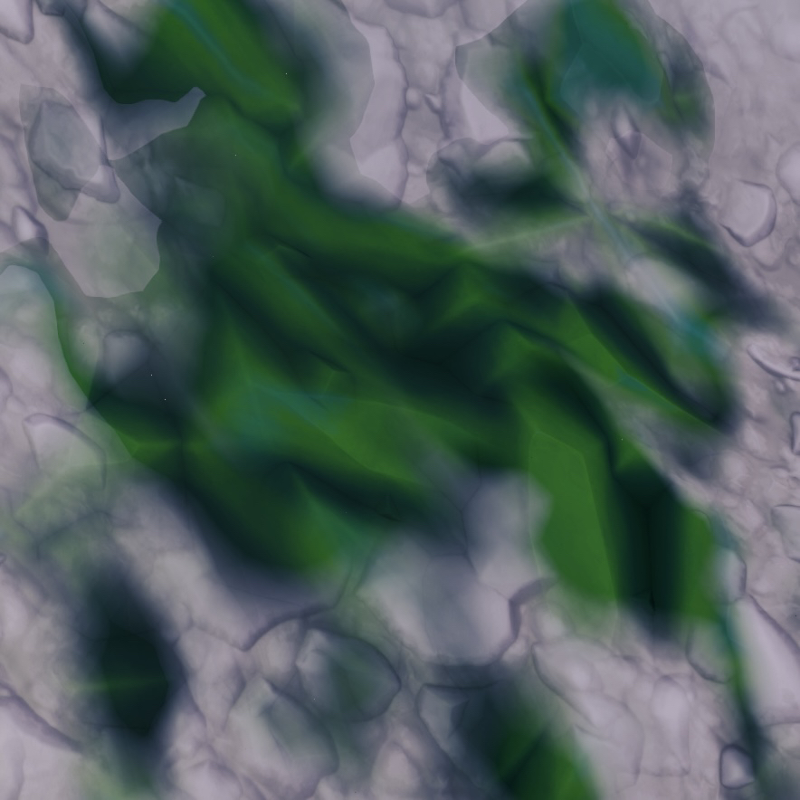
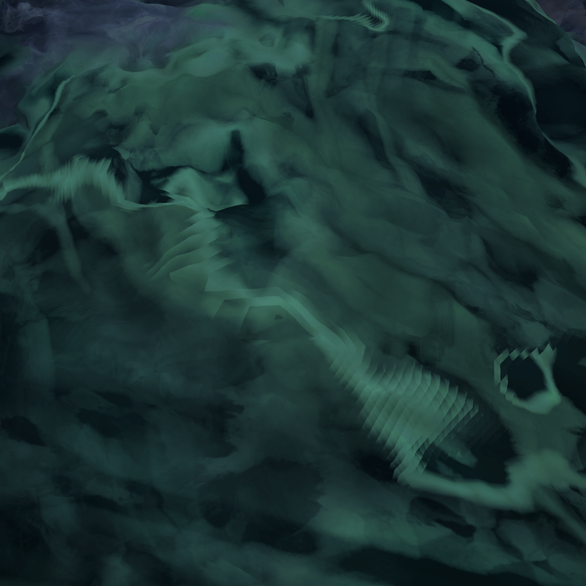

## Crafting

### Metal Tiers

> 1. T1 Metals - Iron, Gold, Copper, Lead, Magnetized Iron, Silver
>    - Locations:
>        - Gold: Rodin IV

>        - Iron: Asteroids, dark layer strip along the inner sides of the asteroid

2. T2 Metals - Bismuth, Mercury, Platinum, Tin, Zinc
3. T3 Metals - Manganese, Chromium, Cadmium, Cobalt, Nickel
>    - Locations:
>        - Manganese: Asteroids, dark layer strip along the inner sides of the asteroid

>        - Chromium: Asteroids, white layer strip along the inner sides of the asteroid

4. T4 Metals - Aluminum, Magnesium, Palladium, Titanium, Tungsten Uranium
5. T5 Metals - Anti-Gravium, Lithium
>    - Locations:
>        - Anti-Gravium: Quartz flats area on Pyromycis (Red Portal), dig under the the raised quartz areas that have water.

### Gases

> - Reactive Gases - Fluorine, Methane
> - Inert Gases - Radon

### Gemstones

> - Agate - Location: Quartz flats area on Pyromycis (Red Portal), look for the large dark rock formations

- Bismuth - Location: Quartz flats area on Pyromycis (Red Portal), look for the large dark rock formations

- Emerald - Location:

- Garnet - Location:
- Jade - Location: Pyromycis (Red Portal), in a cave almost directly under the portal.

- Lapis Lazuli - Location:
- Opal - Location: Escarion (White Portal)

- Ruby - Location: Rodin IV (Green Portal)

- Sapphire - Location:
- Turquoise - Location:
- Zircon - Location: